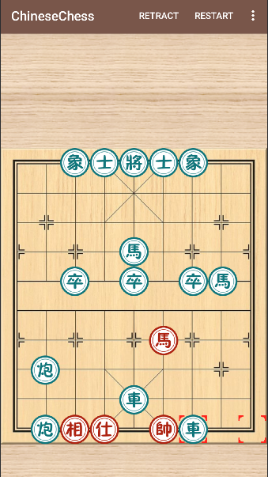
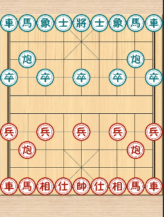

# ChineseChess

A Chinese Chess game for Android with AI opponent featuring intelligent gameplay and custom UI.

## Features

- Complete Chinese Chess game implementation
- AI opponent with Minimax algorithm and Alpha-Beta pruning
- Custom Canvas-based UI rendering
- Move validation and game state management
- Undo functionality and game history
- Sound effects and visual feedback
- Configurable AI difficulty levels

## Technical Stack

- **Language**: Java 17
- **Platform**: Android (API 15+)
- **Build**: Gradle
- **UI**: Custom View with Canvas API
- **AI**: Minimax algorithm with Alpha-Beta pruning
- **Optimization**: Zobrist hashing, transposition tables
- **Architecture**: MVC pattern

## Installation

1. Clone the repository
2. Open in Android Studio
3. Build and run on Android device or emulator

## Game Controls

- Tap a piece to select it
- Tap destination square to move
- Use menu options for game settings and controls

## AI Features

The AI opponent uses advanced search algorithms:
- Minimax algorithm for decision making
- Alpha-Beta pruning for performance optimization
- Transposition tables for caching search results
- Zobrist hashing for position management

## Screenshots

